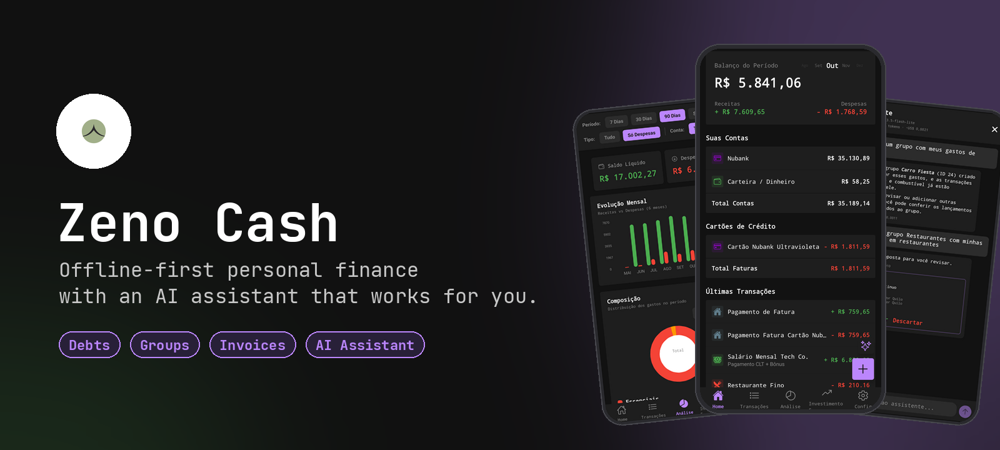
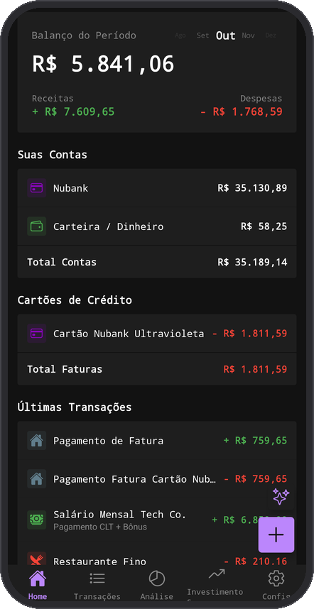
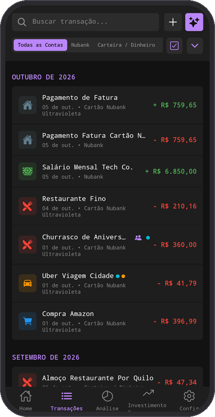
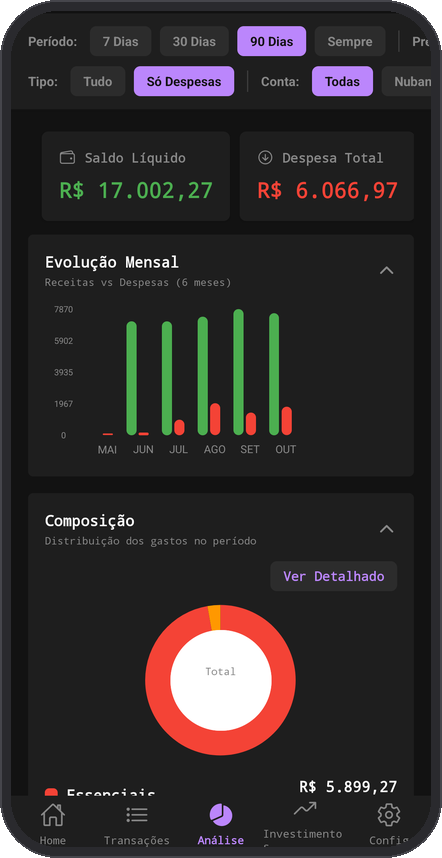
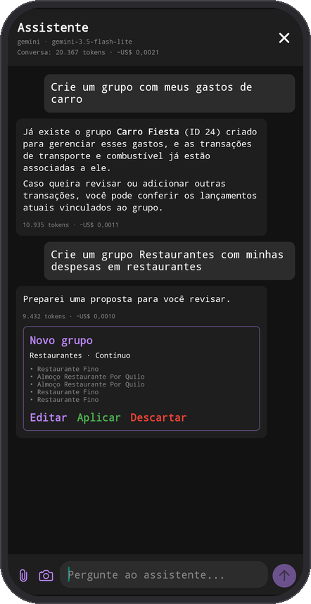
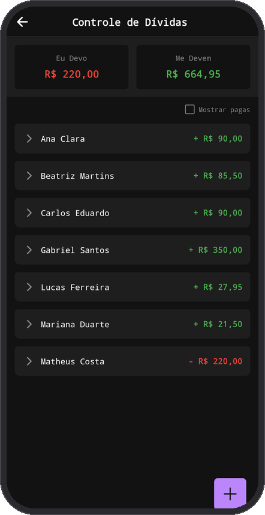
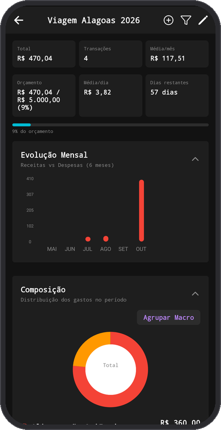
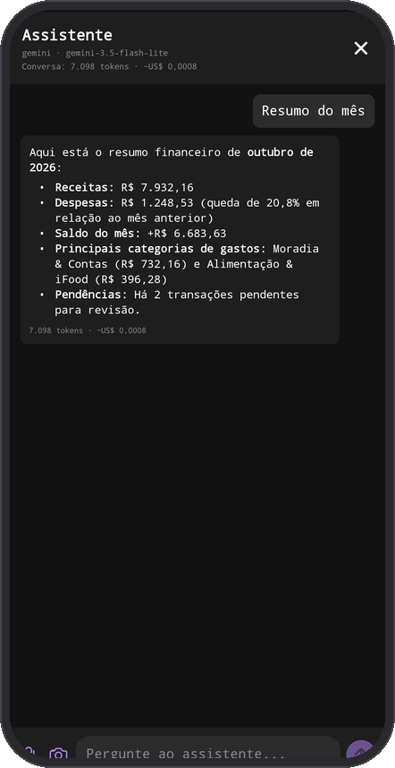
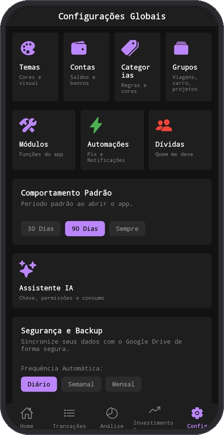

<p align="center">
  
</p>

<p align="center">
  <a href="https://zeno-cash.vercel.app/"><b>Live web demo</b></a> ·
  <a href="#-features">Features</a> ·
  <a href="#-getting-started">Getting started</a> ·
  <a href="#-architecture">Architecture</a>
</p>

<p align="center">
  
  
  
  
  
  
</p>

**Zeno Cash** is a personal finance app built with React Native and Expo. Your data lives on your device, Android bank notifications become transactions automatically, credit card invoices are calculated for you, and an AI assistant can answer questions about your money and propose changes you approve with one tap.

> The app UI is in Portuguese (PT-BR). The [web demo](https://zeno-cash.vercel.app/) runs entirely in the browser, with no sign-up.

<p align="center">
  
  
  
  
</p>

## ✨ Features

### 💳 Accounts, cards and invoices

Track bank accounts, cash and credit cards side by side. Invoice cycles are computed from each card's closing and due days, roll-over balances are carried between months, and the Home lets you jump between months or select several at once. Recurring bills and installments are generated on schedule.

Bank notifications on Android are read with `react-native-android-notification-listener` and logged as transactions, and a home screen widget (`react-native-android-widget`) shows your balance at a glance.

### 🤝 Debts and bill splitting

<table>
  <tr>
    <td width="30%"></td>
    <td>
      Split any transaction between people (names you used before are suggested as you type) or log standalone debts.
      <br/><br/>
      Marking a debt as paid creates a <b>settlement</b> transaction on the right account or on the same card invoice as the purchase, so your balances stay real. Unmarking it, or deleting the settlement, reopens the debt. Home and the Debts screen always agree on what is still pending, and a <i>show paid</i> filter keeps old debts editable.
    </td>
  </tr>
</table>

### 🗂️ Transaction groups

<table>
  <tr>
    <td>
      Put transactions into groups without touching their categories. A transaction can belong to many groups.
      <br/><br/>
      <b>Event groups</b> (e.g. <i>Trip Alagoas 2026</i>) have dates and a budget, with progress, daily average and days left. <b>Ongoing groups</b> (e.g. <i>Car Fiesta</i>) show monthly and yearly averages.
      <br/><br/>
      Each group has its own analysis screen. Transactions can be added in bulk, automatic rules (keywords, categories, account, amount, period) pick up new ones, and groups can be compared side by side.
    </td>
    <td width="30%"></td>
  </tr>
</table>

### ✨ AI assistant

<table>
  <tr>
    <td width="30%"></td>
    <td>
      Chat with your finances using <b>Gemini, OpenAI or Claude</b>. The assistant uses function calling, so it queries only the data it needs (search, totals, month summary, balances, invoices) instead of receiving your whole database.
      <br/><br/>
      It can read receipts from photos or PDFs and propose transactions, groups, rules, edits, deletions, debt settlements, recurrences and settings changes. <b>Nothing is written until you tap Apply</b> on the proposal card, deletions ask for an extra confirmation, and you choose in <i>Settings → AI Assistant</i> which areas it may touch.
      <br/><br/>
      Replies render as Markdown and show tokens used and an estimated cost per message, per conversation and per month.
    </td>
    <td width="30%"></td>
  </tr>
</table>

### ⚙️ Make it yours

<table>
  <tr>
    <td>
      Themes, accounts, categories, groups, UI modules and automations are all configurable. Backups go to Google Drive on a schedule, and data can be exported as JSON or CSV.
    </td>
    <td width="30%"></td>
  </tr>
</table>

## 🚀 Getting started

**Prerequisites:** Node.js and either the Expo Go app on your phone or an Android emulator.

```bash
git clone https://github.com/Droppicode/Zeno-Cash.git
cd Zeno-Cash
npm install

npx expo start   # Android / iOS (scan the QR code with Expo Go)
npm run web      # web version in the browser
```

To try the app with realistic data, open **Config** and use *Popular Dados Mock (Seed Dev)*.

**AI assistant:** add your own API key in **Config → Assistente IA**. The key is stored only on the device (SecureStore on Android, `localStorage` on web) and requests go straight to the provider, with no backend in between.

## 📦 Android release

After bumping `expo.version` in `app.json` on `main`, push a tag such as `vX.Y.Z-alpha` with the matching version. The Android release action builds and verifies the APK, then publishes it as a GitHub pre-release.

## 🏗️ Architecture

| Layer | Technology |
| --- | --- |
| App | React Native + Expo, React Navigation |
| Storage (Android) | `expo-sqlite` + Drizzle ORM, fully offline |
| Storage (web) | `sql.js` (WebAssembly) + Drizzle, persisted in `localStorage` |
| Charts | `react-native-gifted-charts` |
| AI | Provider adapters for Gemini, OpenAI and Claude with a shared tool-calling runner (`src/services/ai`) |
| Android extras | Notification listener, home screen widget, Google Drive backup |

```
.
├── src/
│   ├── screens/        # Home, Transactions, Analytics, Groups, Debts, Assistant, Settings…
│   ├── components/     # Reusable UI and Home cards
│   ├── hooks/          # Data hooks (transactions, analytics, groups…)
│   ├── database/       # Drizzle schema, native/web drivers and seed
│   ├── services/       # Repositories and AI (providers, tools, permissions, usage)
│   ├── context/        # Settings and extraction state
│   └── widget/         # Android home screen widget
├── website/            # Landing page (Vite + React)
└── .agents/skills/     # End-to-end test script for web and Android
```

## 🧪 Testing

[`.agents/skills/zeno-cash-e2e-test/SKILL.md`](.agents/skills/zeno-cash-e2e-test/SKILL.md) is a full end-to-end test plan covering every screen on web and Android: transactions, splits and debts, cards and invoices, month switching, filters, groups, the AI assistant and all settings. It starts from a reset database with known seed data and checks balances and totals after each step.

Run `npm test` for unit tests and `npm run lint` for ESLint.
